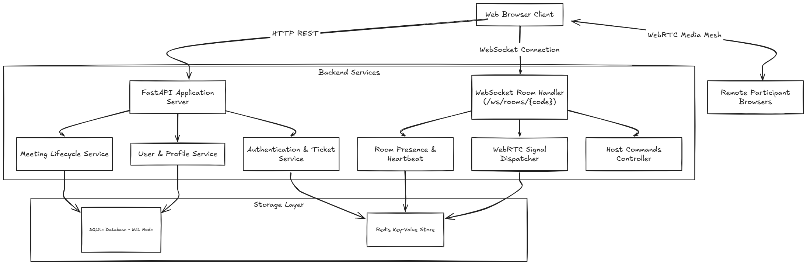
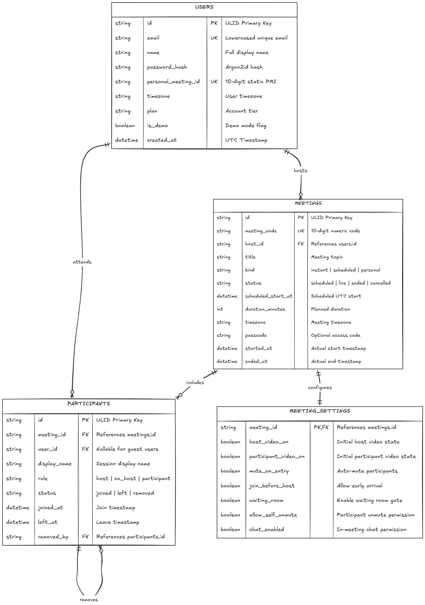
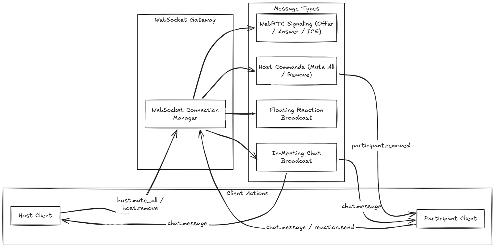
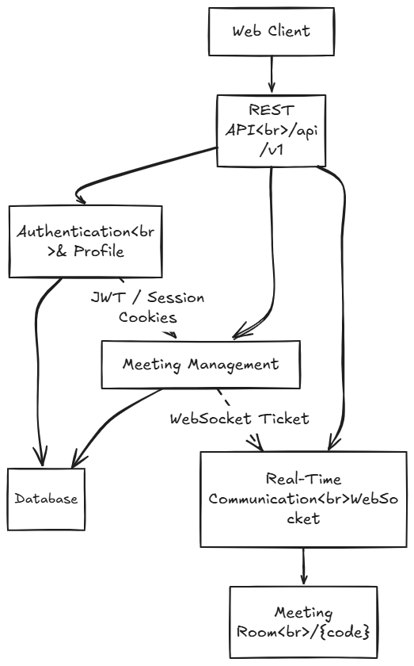
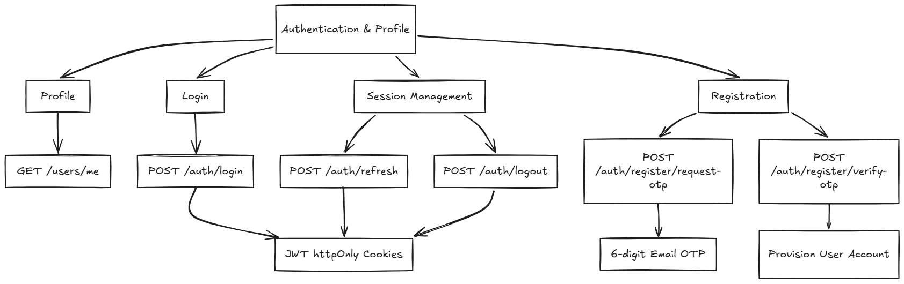
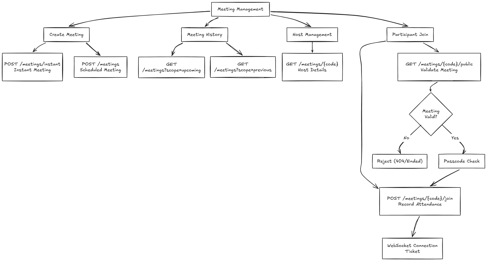
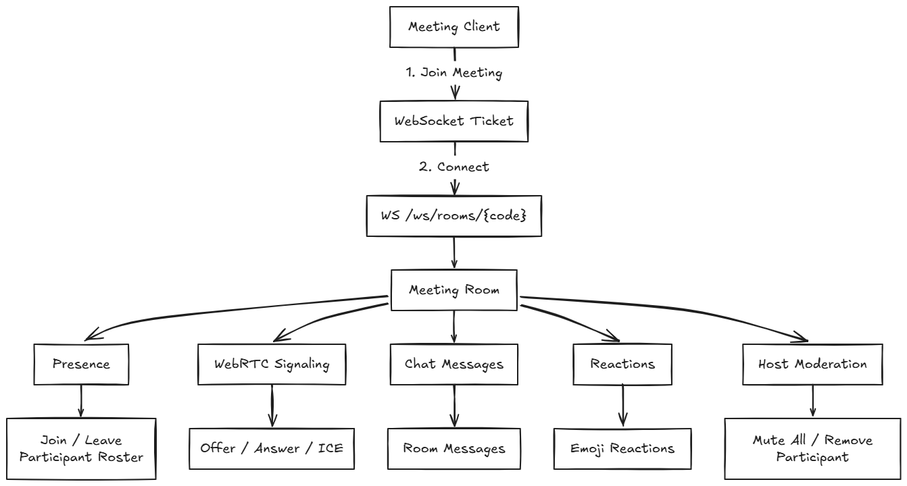

# Zoom Clone - Web Conferencing Platform


A full-stack Zoom web application clone built with Next.js, FastAPI, SQLite, and WebSockets. The application replicates Zoom's core portal design, meeting scheduling workflows, participant management, and real-time audio/video communication.

---

## Live Demo & Links

* **Frontend Web Application**: https://zoom-2.netlify.app
* **Backend API Server**: https://zoom-clone-pr52.onrender.com
* **Swagger API Documentation**: https://zoom-clone-pr52.onrender.com/docs
* **GitHub Repository**: https://github.com/AnilKumt/zoom-clone

---

## Tech Stack Overview

* **Frontend**: Next.js 14+ (App Router, Single Page Application mode, TypeScript)
* **Backend**: Python 3.12, FastAPI (Asynchronous), Uvicorn ASGI
* **Database**: SQLite with Write-Ahead Logging (WAL) mode, SQLAlchemy 2.0 (Async), Alembic
* **Real-Time & Ephemeral State**: Redis (Upstash) with in-memory fallback for local development
* **Audio / Video Streaming**: WebRTC Peer-to-Peer Mesh (decoupled audio element architecture)
* **UI & Styling**: Tailwind CSS, Material Design 3 surface tokens, Radix UI, Lucide Icons, Sonner

---

<details open>
<summary><b>1. System Architecture</b></summary>

The platform separates persistent domain entities from ephemeral real-time state. Next.js handles portal routing and meeting room rendering, communicating via HTTP REST for transactional operations and WebSockets for real-time room events.



### Architectural Highlights
* **Decoupled State Layers**: Persistent data (users, scheduled meetings, attendance history) lives in SQLite. High-frequency ephemeral data (30-second single-use WebSocket tickets, room presence rosters, signaling messages) is processed in Redis.
* **First-Party API Gateway**: In development and production, Next.js rewrites route `/api/*` traffic directly to FastAPI, ensuring consistent cookie handling without cross-origin configuration issues.
* **Resilient Media Architecture**: Local audio and video streams are managed through a decoupled media pipeline, ensuring participant audio continues uninterrupted even when video tracks are disabled.

</details>

---

<details>
<summary><b>2. Core Meeting Workflows</b></summary>

The application implements Zoom's core user journey from initial dashboard landing to meeting creation, pre-call lobby testing, and in-room collaboration.

### Implemented Workflow Steps
1. **Landing Dashboard (`/home`)**: Renders Zoom top navigation bar, sidebar, user profile card with Personal Meeting ID (PMI), quick action tiles (Schedule, Join, New Meeting), upcoming meetings list, and previous meeting history.
2. **Instant Meeting Creation**: Generates a collision-resistant 10-digit numeric meeting ID, creates shareable `/j/{code}` invite links, and routes the host into the room.
3. **Join Meeting Flow (`/join`)**: Accepts 10-digit numeric codes (raw, dashed, or spaced) and full invite URLs. Validates meeting existence and passcode requirements before granting entry.
4. **Meeting Scheduling (`/meetings/schedule`)**: Configures title, description, start timestamp, duration, timezone, passcode protection, and initial host/participant media settings.
5. **Pre-Meeting Lobby (`/meeting/{code}/lobby`)**: Provides live camera preview, audio mute controls, display name input, and hardware permission fallback before connecting to the live room.

</details>

---

<details>
<summary><b>3. Database Schema & Data Modeling</b></summary>

The database schema is designed for SQLite in Write-Ahead Logging (WAL) mode, maintaining relational integrity, table normalization, and attendance history.



### Schema Design Decisions
* **1:1 Settings Separation**: Extracted `meeting_settings` into a dedicated table linked by foreign key to keep the `meetings` table narrow and optimized for frequent list and dashboard queries.
* **Immutable Attendance Records**: Each join operation writes a new `participants` record. Rejoining participants generate a new entry, preserving accurate historical session attendance.
* **ULID Primary Keys**: Universally Unique Lexicographically Sortable Identifiers provide chronological ordering and eliminate sequential enumeration vulnerabilities.
* **Database Indexes**: Composite indexes on `(host_id, status, scheduled_start_at)` and `(meeting_id, status)` ensure single-digit millisecond query execution for portal dashboards.

</details>

---

<details>
<summary><b>4. Real-Time WebSockets & Host Controls</b></summary>

WebSocket communication coordinates room state synchronization, WebRTC signaling exchange, in-meeting chat, floating emoji reactions, and server-enforced host controls.



### Real-Time Features
* **Single-Use WebSocket Tickets**: Tickets expire after 30 seconds and are verified on connection handshake, preventing credentials from leaking in URL logs.
* **Host Control Enforcement**: Hosts can mute individual attendees, trigger room-wide **Mute All**, or remove disruptive users. Removed users receive a termination event, close media tracks, and redirect to the dashboard.
* **Real-Time Chat Synchronization**: Instant message delivery across all connected peers with unread counter badges and sender timestamps.
* **Synchronized Reactions**: Broadcasts floating emoji animations across participant video tiles with single-render deduplication.

</details>

---

<details>
<summary><b>5. Setup and Operations</b></summary>

### Prerequisites
* Docker & Docker Compose **OR** Local Node.js 20+ and Python 3.12+
* Git

---

### Option A: Docker Compose (Recommended Quickstart)
Run the entire platform (Next.js web client, FastAPI backend, Redis, and seeded SQLite volume) with a single command:

1. Clone the repository and navigate to the project root:
   ```bash
   git clone https://github.com/AnilKumt/zoom-clone.git
   cd zoom-clone
   ```
2. Build and launch all services in the background:
   ```bash
   docker compose up --build
   ```
3. Access the services:
   * **Web Client**: http://localhost:3000
   * **API Docs / Swagger**: http://localhost:8000/docs
   * **Redis Instance**: localhost:6379

---

### Option B: Manual Local Setup

#### 1. Backend Setup
1. Navigate to the API directory:
   ```bash
   cd apps/api
   ```
2. Create and activate a Python virtual environment:
   * **Windows (PowerShell)**:
     ```powershell
     python -m venv .venv
     .venv\Scripts\Activate.ps1
     ```
   * **macOS / Linux**:
     ```bash
     python -m venv .venv
     source .venv/bin/activate
     ```
3. Install backend dependencies:
   ```bash
   pip install -e ".[dev]"
   ```
4. Copy the environment variables template:
   ```bash
   cp .env.example .env
   ```
5. Seed initial demo users and mock meetings:
   ```bash
   python -m app.seed
   ```
6. Start the FastAPI development server:
   ```bash
   python -m uvicorn app.main:app --reload --port 8000
   ```

#### 2. Frontend Setup
1. Navigate to the web application directory in a new terminal:
   ```bash
   cd apps/web
   ```
2. Install npm dependencies:
   ```bash
   npm install
   ```
3. Copy the environment variables template:
   ```bash
   cp .env.example .env.local
   ```
4. Start the Next.js development server:
   ```bash
   npm run dev
   ```
5. Open your browser and navigate to: **http://localhost:3000**

</details>

---

<details>
<summary><b>6. API Specifications</b></summary>

### 6.1 High-Level API Architecture

The application exposes a unified REST and WebSocket API gateway under `/api/v1`. Client interactions transition through authentication, meeting provisioning, and real-time room communication.



---

### 6.2 Authentication & Profile API

Manages user registration via email OTP verification, password login with rotating JWT session cookies, and user profile discovery.



#### Authentication Endpoints & Contracts
* `GET /api/v1/users/me` (or `/api/v1/me`) - Returns authenticated user data, Personal Meeting ID, and active plan tier.
* `POST /api/v1/auth/register/request-otp` - Initiates account creation by generating an HMAC-hashed 6-digit verification code.
* `POST /api/v1/auth/register/verify-otp` - Verifies the submitted OTP and creates the user in SQLite.
* `POST /api/v1/auth/login` - Validates email and Argon2id password hash, setting `access_token` and `refresh_token` httpOnly cookies.
* `POST /api/v1/auth/refresh` - Rotates expired access tokens using a valid refresh token.
* `POST /api/v1/auth/logout` - Revokes refresh session and clears authentication cookies.

---

### 6.3 Meeting Management API

Handles instant room creation, meeting scheduling, portal history queries, pre-join validation, and participant attendance recording.

#### Meeting Endpoints & Query Parameters
* `POST /api/v1/meetings/instant` - Generates a 10-digit meeting ID, creates an active meeting row, and returns a shareable invite URL.
* `POST /api/v1/meetings` (or `/api/v1/meetings/schedule`) - Validates scheduled start time, duration, timezone, and custom entry settings.
* `GET /api/v1/meetings?scope=upcoming` (or `?type=upcoming`) - Returns scheduled meetings where `scheduled_start_at >= now`.
* `GET /api/v1/meetings?scope=previous` (or `?type=recent`) - Returns completed meetings where `status = ended` ordered chronologically.
* `GET /api/v1/meetings/{code}/public` - Public pre-join check verifying existence, live status, host name, and passcode requirement.
* `POST /api/v1/meetings/{code}/join` - Creates an attendance record in `participants` and mints a 30-second single-use WebSocket ticket.
* `POST /api/v1/meetings/{code}/end` - Host action transitioning meeting status to `ended` and recording `ended_at`.
* `GET /api/v1/meetings/{code}/participants` - Lists all participant attendance rows for the meeting.



---

### 6.4 Real-Time Communication & WebSocket Protocol

Coordinates peer presence, WebRTC mesh signaling exchange, in-meeting chat, and server-enforced host controls over full-duplex WebSockets.



#### Real-Time Event Catalog
* `room.snapshot`: Initial state payload dispatched upon connection, providing the full participant roster and media states.
* `participant.joined` / `participant.left`: Real-time roster updates broadcast to all connected attendees.
* `rtc.offer` / `rtc.answer` / `rtc.ice`: Targeted WebRTC peer connection signaling payloads.
* `chat.message`: In-meeting text message broadcast carrying sender identity, message content, and timestamps.
* `reaction.received`: Ephemeral floating emoji animation events displayed across video tiles.
* `host.muted_all` / `participant.removed`: Server-validated host commands triggering client state enforcement and disconnection.

</details>

---

<details>
<summary><b>7. Production Scaling & Engineering Trade-offs</b></summary>

### 1. WebRTC Mesh vs. Selective Forwarding Unit (SFU)
* **Current Implementation (Mesh Topology)**: Each participant establishes direct peer connections with every other attendee. This eliminates server media processing costs and minimizes latency for small meetings (2–4 users).
* **10x Scale Bottleneck**: Network uplink requirements scale quadratically ($O(N^2)$), causing bandwidth saturation on client devices with 5+ participants.
* **Production Resolution**: Transition to an SFU media routing server (such as LiveKit or mediasoup). Clients publish a single upstream feed, and the SFU distributes downstream tracks based on active speaker detection and bandwidth estimates.

### 2. SQLite Concurrency vs. Distributed PostgreSQL
* **Current Implementation**: SQLite running in WAL mode with connection busy-timeouts handles concurrent reads seamlessly with minimal memory footprint.
* **10x Scale Bottleneck**: Database writes remain serialized through a single file lock, limiting throughput under high-frequency transaction bursts across distributed nodes.
* **Production Resolution**: Replace the async SQLite engine with a managed PostgreSQL cluster using SQLAlchemy's asyncpg driver, backed by PgBouncer connection pooling.

### 3. Audio Decoupling Architecture
* **Problem**: Standard HTML5 video elements attach audio playback to video rendering. Disabling video tracks frequently mutes participant audio in mesh topologies.
* **Resolution**: Audio and video streams are managed through dedicated stream references. Audio elements remain mounted in the DOM regardless of video track enable states.

</details>

---

<details>
<summary><b>8. Verification & Automated Test Suites</b></summary>

To validate frontend layout calculations, meeting code parsing, and API behavior, run the automated test suites:

### 1. Frontend Test Suite
Validates dynamic grid layout calculations across varying participant counts, 10-digit meeting code normalizers, and invite URL parsers:
```bash
cd apps/web
npm test
```

### 2. Backend Test Suite
Executes unit and integration tests across database models, meeting creation services, and authentication dependencies:
```bash
cd apps/api
pytest tests/ -v
```

### 3. Manual Multi-User Verification
1. **Host Session**: Open the application at `http://localhost:3000` and click **New Meeting**.
2. **Guest Session**: Open a private/incognito window, navigate to the invite link or `/join`, and enter a guest display name.
3. **Verify Features**:
   * Verify two-way WebRTC camera and decoupled audio communication.
   * Send chat messages and verify real-time cross-client delivery.
   * Send emoji reactions and verify single-render animations on video tiles.
   * Trigger **Mute All** or **Remove Participant** from the host controls and observe instant client synchronization.

</details>
