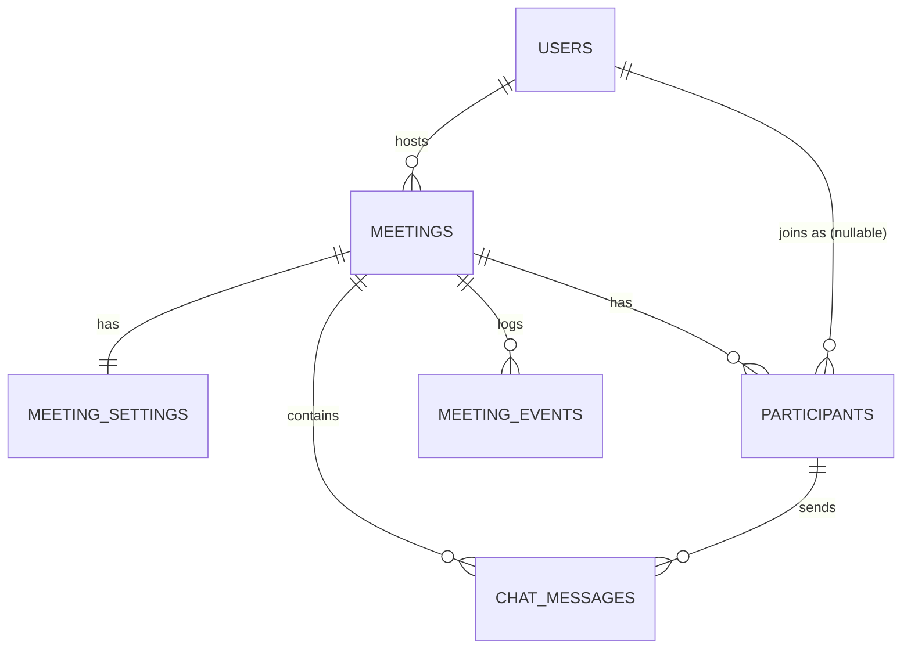

# Database Design

## ER Diagram



## Pragmas (applied to every connection)

```sql
PRAGMA journal_mode=WAL;      -- concurrent readers, one writer
PRAGMA foreign_keys=ON;       -- enforce referential integrity
PRAGMA busy_timeout=5000;     -- wait up to 5s on write lock
PRAGMA synchronous=NORMAL;    -- safe + fast (not FULL)
```

## Table: `users`

| Column | Type | Constraints | Notes |
|---|---|---|---|
| id | TEXT PK | ULID | Sortable, URL-safe |
| email | TEXT | UNIQUE, NOT NULL, CHECK(lower) | Lowercased on insert |
| name | TEXT | NOT NULL | |
| password_hash | TEXT | NULL | NULL for demo user |
| avatar_url | TEXT | NULL | |
| personal_meeting_id | TEXT(10) | UNIQUE, NOT NULL | 10 digits |
| personal_link_name | TEXT(32) | UNIQUE, NULL | `[a-z0-9._-]{3,32}` |
| timezone | TEXT | default UTC | IANA identifier |
| plan | TEXT | default workplace_basic | |
| is_demo | BOOLEAN | default false | |
| is_active | BOOLEAN | default true | soft-delete flag |
| created_at, updated_at | DATETIME | UTC | via TimestampMixin |

**Design reason:** `email = lower(email)` CHECK prevents case-mismatch duplicates without application code. `personal_meeting_id` is separate from `id` because it's public-facing and must be 10 digits.

## Table: `meetings`

| Column | Type | Constraints | Notes |
|---|---|---|---|
| id | TEXT PK | ULID | |
| meeting_code | TEXT(10) | UNIQUE, NOT NULL | Public 10-digit ID |
| host_id | TEXT | FK → users, RESTRICT, indexed | |
| title | TEXT | NOT NULL | |
| description | TEXT | NULL | |
| kind | TEXT | CHECK IN ('instant','scheduled','personal') | |
| status | TEXT | CHECK IN ('scheduled','live','ended','cancelled'), indexed | |
| scheduled_start_at | DATETIME | NULL for instant | UTC |
| duration_minutes | INTEGER | CHECK 5–1440 | |
| timezone | TEXT | IANA | Display only |
| passcode | TEXT | NULL | NULL = no passcode |
| started_at, ended_at | DATETIME | NULL | UTC, set on transition |
| created_at, updated_at | DATETIME | UTC | |

**Indexes:**
- `UNIQUE(meeting_code)` — collision detection for optimistic insert
- `(host_id, status, scheduled_start_at)` — upcoming meetings query
- `(host_id, ended_at DESC)` — recent meetings query
- `(status)` — room lookup by status

**Design reason:** `meeting_code` is a separate column from `id` (ULID) because it must be exactly 10 digits in a public-facing format. `ON DELETE RESTRICT` on host_id prevents orphaning meetings — the host must be deactivated first.

## Table: `meeting_settings` (1:1 with meetings)

| Column | Notes |
|---|---|
| meeting_id | PK + FK → meetings CASCADE |
| host_video_on | |
| participant_video_on | |
| mute_on_entry | |
| join_before_host | |
| waiting_room | |
| allow_self_unmute | default true |
| chat_enabled | default true |

**Design reason:** Separating settings from meetings keeps the `meetings` table narrow (SRP at the table level). The `CASCADE DELETE` means settings are cleaned up automatically.

## Table: `participants` (one row per join session)

| Column | Notes |
|---|---|
| id | ULID PK |
| meeting_id | FK → meetings CASCADE |
| user_id | FK → users, **NULL for guests** |
| guest_key | random hex for guests (ban target) |
| display_name | snapshot — not a FK to users.name |
| role | CHECK IN ('host','co_host','participant') |
| status | CHECK IN ('joined','left','removed') |
| joined_at | NOT NULL |
| left_at | NULL while joined |
| removed_by | FK → participants.id |

**Indexes:**
- `(meeting_id, status)` — active participants in room
- `(user_id, joined_at DESC)` — attendance history
- Partial UNIQUE `(meeting_id, user_id) WHERE status='joined' AND user_id IS NOT NULL` — prevents double-join

**Design reason:** One row per **join session** (not per user per meeting) preserves attendance history. `display_name` is a **snapshot** — if the user later renames themselves, historical records stay correct. `removed_by` enables audit without a separate audit table.

## Table: `chat_messages`

| Column | Notes |
|---|---|
| id | ULID PK |
| meeting_id | FK CASCADE |
| participant_id | FK |
| sender_name | snapshot |
| body | ≤ 2000 chars |
| sent_at | UTC |

**Index:** `(meeting_id, sent_at)` — load chat history in order.

## Table: `meeting_events` (append-only audit log)

| Column | Notes |
|---|---|
| id | ULID PK |
| meeting_id | FK CASCADE |
| actor_participant_id | FK NULL |
| type | e.g. `meeting.started`, `participant.removed` |
| payload | JSON |
| created_at | UTC |

**Design reason:** Append-only table fed by the event bus. Never updated. Provides a durable audit trail without polluting the `meetings` table.

## Normalization

- **3NF**: no transitive dependencies. `participants.display_name` violates 3NF intentionally (it's a snapshot of `users.name` at join time) — this is a documented denormalization for historical correctness.
- **Soft delete**: `status='cancelled'` on meetings, `is_active=false` on users. No hard deletes of meetings that have participants.
- **No ENUM types**: SQLite doesn't have native ENUMs; CHECK constraints serve the same purpose and are verifiable at DB level.
