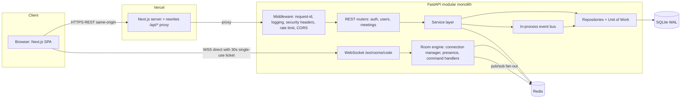

# High-Level Design (HLD)

## 1. System Overview

zoom-clone is a **modular monolith**: one FastAPI deployable with strict internal module boundaries. The frontend is a Next.js SPA that proxies all REST calls through Next.js rewrites so the browser only ever talks to one origin.

## 2. System Diagram



## 3. Why Each Component Exists

| Component | Responsibility | Design reason |
|---|---|---|
| Next.js rewrites `/api/* → API_ORIGIN` | Makes browser talk to **one origin** | Cookies become first-party (`SameSite=Lax` works); no CORS pain; Safari/Chrome third-party-cookie blocking cannot break auth |
| WebSocket goes **direct** to API | Vercel cannot proxy WebSockets | Authenticated by a **single-use 30-second ticket** minted over REST (`GETDEL` in Redis) so no long-lived token in the URL |
| Middleware stack | Cross-cutting: request-id, structured logs, security headers, rate limiting | Chain of Responsibility; keeps handlers clean |
| Routers | HTTP only: parse, validate, call service, shape response | SRP |
| Services | Business rules and orchestration | Testable without HTTP |
| Repositories + Unit of Work | Persistence behind interfaces; one transaction per use case | DIP; swap DB later |
| Event bus | `MeetingStarted`, `ParticipantJoined`, … decouple side-effects | Observer, OCP |
| Redis | Ephemeral, shared, fast state | Correct tool for TTL/counters/pub-sub; SQLite stays for durable facts |
| SQLite (WAL) | Durable truth: users, meetings, participants, events, chat | Required by assignment; WAL + `busy_timeout` for concurrent readers |

## 4. Non-Functional Requirements

| NFR | Target | How |
|---|---|---|
| Latency | P95 REST < 150ms local; join < 300ms | Indexes, cache-aside on meeting lookup, no N+1 |
| Availability | Graceful if Redis dies | Rate-limit **fail-open** (logged); OTP/session **fail-closed**; `KeyValueStore` falls back to MemoryStore in dev |
| Scalability | Horizontal API scale | Stateless API; presence + fan-out in Redis; sticky sessions not required |
| Security | OWASP top-10 basics | See `SECURITY.md` |
| Observability | Debuggable in prod | JSON logs + request-id + `/healthz` `/readyz` |
| Consistency | No duplicate meetings/double actions | Unique constraints + idempotency keys + Redis lock |
| Maintainability | New feature without editing old code | Registries and interfaces (OCP) |

## 5. Scaling Story

1. **API instances are stateless.** Room state lives in Redis (`HASH` presence, pub/sub channel per room). Any instance can serve any socket; broadcasts go through Redis so users on different instances still see each other.
2. **SQLite → Postgres** is a config change (`DATABASE_URL`) plus Alembic; repositories hide the dialect.
3. **Mesh WebRTC** caps at ~4–6 peers; the next step is an SFU (LiveKit/mediasoup). Signaling contract does not change.
4. **Modules split to services** along the existing bounded contexts; Redis pub/sub becomes Kafka/NATS.

## 6. Auth Mode Strategy

`AUTH_MODE=demo` (default for evaluators): the seeded default user is returned from `get_current_user` without any token. Sign-in / sign-up still work end-to-end and switch the session to the real user. A **"Demo mode"** chip appears in the avatar menu.

`AUTH_MODE=full`: requires a valid access-token cookie; `/welcome` is shown to unauthenticated users.

## 7. Module Boundaries

Python dependency rule enforced by `import-linter`:

```
router → service → repository → models
modules/X imports modules/Y ONLY through Y's service interface or events
```

TypeScript boundary enforced by ESLint:

```
app/* → features/* → components/ui, lib, hooks
features/A must not import from features/B internals
```
