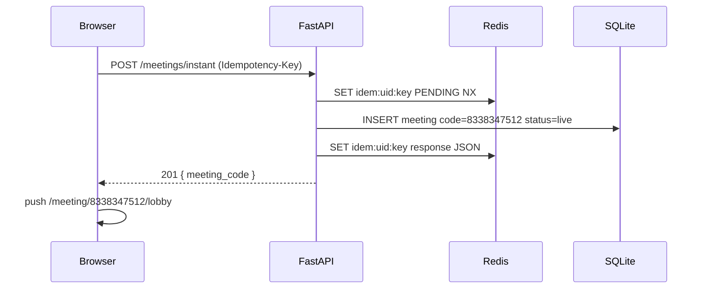
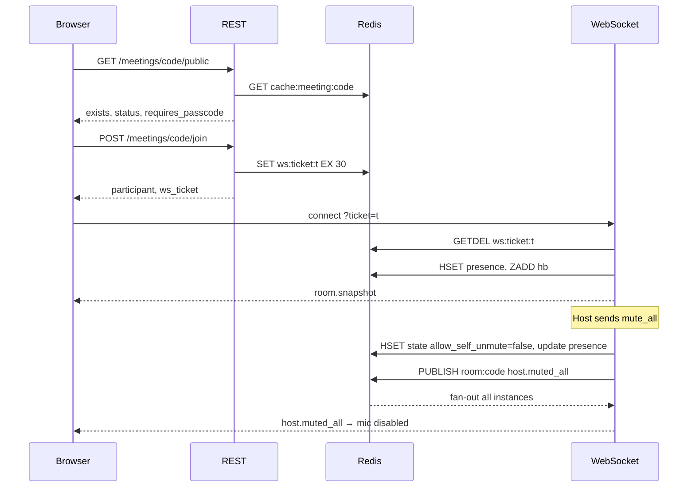

# JOURNEYS.md — Step-by-Step Flow Walkthroughs

> Written in the style of the auth.pdf reference — each journey broken into steps with Frontend Request → Backend Process → Redis State → Database State → Response, plus a "Like I'm 5" explanation.

---

## Analogy Bank

- **Redis** = sticky notes on a fridge that fall off by themselves (TTL)
- **Database** = the filing cabinet — durable, permanent
- **JWT access token** = a 15-minute day-pass
- **Refresh token** = a 7-day membership card that gets swapped for a new one each use
- **Rate limiter** = a doorman counting how many times you knock
- **WS ticket** = a one-time cinema ticket torn at the door
- **Presence heartbeat** = "raise your hand every 25 seconds if you're still here"
- **Event bus** = a loudspeaker: the meeting service shouts "meeting started!" and whoever cares reacts
- **Idempotency key** = a sticker on your request so if you press the button twice, the hotel gives you the SAME room

---

## Journey 1: Instant Meeting

```
createInstantMeeting()
├── Browser: POST /api/v1/meetings/instant
│   └── Header: Idempotency-Key: 9f2c3a...
├── Middleware chain
│   ├── RequestIdMiddleware → X-Request-ID: req-abc123
│   ├── RateLimitMiddleware → check rl:global:user:demo-uid → 1/1000 ✅
│   └── Auth: cookie present? demo mode → user-uuid-123 ✅
├── MeetingService.create_instant(user, idem_key)
│   ├── SET idem:user-uuid-123:9f2c3a "PENDING" NX EX 86400 → OK ✅
│   ├── Generate code → "8338347512"
│   ├── INSERT meetings (status=live, kind=instant, meeting_code=8338347512)
│   │   └── UNIQUE clash? → retry (max 5 attempts) — extremely rare
│   ├── INSERT meeting_settings (defaults)
│   ├── EventBus.publish(MeetingStarted)
│   │   └── subscriber → INSERT meeting_events(type="meeting.started")
│   ├── SET idem:user-uuid-123:9f2c3a {response JSON} EX 86400 ✅
│   └── Return meeting + invite_url
└── Response: 201 { meeting_code, invite_url, ... }

Redis State:
  idem:user-uuid-123:9f2c3a → {meeting JSON} (24h)

Database:
  meetings: id=ULID, code=8338347512, status=live, kind=instant
  meeting_settings: host_video_on=true, mute_on_entry=false, ...
  meeting_events: type=meeting.started

Browser:
  router.push(/meeting/8338347512/lobby)
```

**Like I'm 5:** A meeting ID is a room number in a hotel. Instant meeting = "give me a new room right now." The idempotency key is a sticker on your request so if you press the button twice, the hotel gives you the SAME room, not two different ones.

---

## Journey 2: Join by ID

### 2a. Valid meeting

```
joinMeeting("833 834 7512")
├── Browser: parse "833 834 7512" → digits "8338347512"
├── GET /api/v1/meetings/8338347512/public  (no auth required)
│   ├── RateLimit check: join_public:ip:1.2.3.4 → 1/30 ✅
│   ├── Redis cache lookup: cache:meeting:8338347512
│   │   ├── HIT → return cached JSON ✅
│   │   └── MISS → SELECT meetings WHERE code=8338347512
│   │       ├── Found, status=live ✅
│   │       └── SET cache:meeting:8338347512 {json} EX 60
│   └── Response: { exists:true, status:"live", requires_passcode:false }
├── Button turns blue → user clicks Join
├── POST /api/v1/meetings/8338347512/join
│   ├── Body: { display_name: "Alice", passcode: null }
│   ├── assert_joinable() → status=live ✅
│   ├── banned check: SISMEMBER room:8338347512:banned user-id → false ✅
│   ├── INSERT participants (role=participant, status=joined)
│   ├── ticket = secrets.token_urlsafe(32)
│   ├── SET ws:ticket:{ticket} {participant JSON} EX 30 ✅
│   └── Response: { participant_id, role, ws_url, ws_ticket, ice_servers }
└── Browser: router.push(/meeting/8338347512/lobby)
```

### 2b. Invalid / ended meeting

```
joinMeeting("9999999999")
├── GET /meetings/9999999999/public
│   └── DB: no row found
│   └── Response: { exists:false }
├── browser shows: "Invalid meeting ID. Check and try again." (shake animation)
│
joinMeeting("8338347512") when status=ended
├── GET /meetings/8338347512/public
│   └── Response: { exists:true, status:"ended" }
└── browser shows: "This meeting has ended"
```

### 2c. Wrong passcode

```
POST /meetings/{code}/join { display_name: "Bob", passcode: "wrong" }
├── meeting.passcode = "ABCD12" ≠ "wrong"
└── raise MeetingNotJoinableError(reason="wrong_passcode")
    Response: 409 { error: { code: "MEETING_NOT_JOINABLE", details: { reason: "wrong_passcode" } } }
Browser: toast("Incorrect passcode")
```

**Like I'm 5:** The meeting ID is the room number. The public endpoint is like asking the hotel desk "does room 8338 exist?" — you don't need a key for that. Joining is asking for a key card. If the passcode is wrong, the key card doesn't work.

---

## Journey 3: Schedule Meeting

```
scheduleMeeting(dto)
├── POST /api/v1/meetings
│   ├── Body: { title, scheduled_start_at, duration_minutes:45, timezone, passcode, ... }
│   ├── Auth: resolve current user ✅
│   ├── Validate: duration 5-1440 ✅, start_at not null ✅
│   ├── INSERT meetings (status=scheduled, kind=scheduled)
│   ├── INSERT meeting_settings (from dto)
│   └── Response: 201 { meeting_code, invite_url, ... }
├── TanStack Query: invalidateQueries(['meetings','upcoming']) → cache bust
├── Dashboard: UpcomingMeetingsCard re-fetches → shows new meeting
└── Browser: router.push(/meetings/{code}) with toast "Meeting scheduled!"

Database:
  meetings: status=scheduled, scheduled_start_at=2026-10-01T09:00:00Z
  meeting_settings: mute_on_entry=false, join_before_host=false
```

**Like I'm 5:** Scheduling a meeting is like booking a conference room for Tuesday at 9am. The room (ID) is reserved but nobody's in it yet.

---

## Journey 4: Room Connect + Presence

```
connectToRoom(code, ticket)
├── WebSocket: ws://api/ws/rooms/8338347512?ticket=abc123
├── WS handler: GETDEL ws:ticket:abc123
│   ├── Returns { participant_id, role, display_name } ✅
│   └── Key deleted (single-use) ✅
├── RoomService.join_ws(participant_id, meeting_code)
│   ├── HSET room:8338347512:presence {pid} {name,role,audio:true,video:true,...}
│   ├── ZADD room:8338347512:hb {now} {pid}
│   └── PUBLISH room:8338347512 {"type":"participant.joined","payload":{...}}
├── Send to client: room.snapshot (full participant list from HGETALL)
└── All connected clients (via Redis pub/sub fan-out):
    receive participant.joined event → toast "Alice joined"

Heartbeat loop (every 25s):
  C→S: { type: "ping" }
  S→C: { type: "pong" }
  ZADD room:8338347512:hb {now} {pid}

Reaper task (background, one per instance, guarded by distributed lock):
  ZRANGEBYSCORE room:{code}:hb 0 (now-60)
  → evict stale pids → HDEL presence → PUBLISH participant.left

Redis State:
  room:8338347512:presence → HASH { pid1: {Alice,host,audio:true}, pid2: {Bob,...} }
  room:8338347512:hb → ZSET { pid1: 1727622000, pid2: 1727622010 }
```

**Like I'm 5:** The WS ticket is a one-time cinema ticket torn at the door — you can't use it twice. The heartbeat is "raise your hand every 25 seconds if you're still here." The reaper is the usher who marks you absent if you stop raising your hand.

---

## Journey 5: Host Mute-All + Remove Participant

### 5a. Mute All

```
host.mute_all (allow_self_unmute: false)
├── C→S: { type: "host.mute_all", payload: { allow_self_unmute: false } }
├── Dispatcher: match handler HostMuteAllHandler
├── PermissionPolicy.can(actor=host, action=MUTE_ALL) → true ✅
│   (non-host would get: S→C error event; WS NOT closed)
├── RoomService.mute_all(code, allow_self_unmute=false)
│   ├── For each pid in HGETALL presence: update audio=false
│   ├── HSET room:{code}:state allow_self_unmute false
│   └── PUBLISH room:{code} { type: "host.muted_all", payload: { allow_self_unmute: false } }
├── Fan-out to ALL clients (via Redis pub/sub):
│   receive host.muted_all
│   → disable local mic track
│   → toast "You have been muted by the host"
│   → aria-live: "You have been muted by the host"
│
│ Later: participant tries to unmute:
│   C→S: { type: "media.state", payload: { audio: true, video: true } }
│   Server checks: allow_self_unmute=false → reject
│   S→C: { type: "error", payload: { code: "SELF_UNMUTE_FORBIDDEN" } }
```

### 5b. Remove Participant

```
host.remove { participant_id: "pid-bob" }
├── PermissionPolicy.can(host, REMOVE, bob) → true (cannot remove host) ✅
├── participants table: UPDATE status='removed', removed_by='pid-host'
├── SADD room:{code}:banned {bob's user_id or guest_key}
├── HDEL room:{code}:presence pid-bob
├── PUBLISH room:{code} { type: "participant.removed", payload: { target: pid-bob, by: pid-host } }
├── Close Bob's WebSocket with code 4003
├── INSERT meeting_events(type="participant.removed", actor=host, payload={target:bob})
└── Bob's client: receives 4003 close → toast "You have been removed from the meeting" → router.push(/home)

If Bob tries to rejoin:
  POST /meetings/{code}/join
  SISMEMBER room:{code}:banned {bob's key} → true
  → 403 BANNED
```

**Like I'm 5:** The host muting everyone is like a teacher saying "everyone quiet." Removing someone is like the teacher asking a student to leave the classroom and locking the door so they can't come back.

---

## Journey 6: Register with OTP

```
register("alice@example.com", "Alice")
├── POST /auth/register/request-otp { email, name }
├── OTP Restriction Chain:
│   ├── GET otp_lock:register:alice@example.com → null ✅
│   ├── GET otp_spam_lock:register:alice@example.com → null ✅
│   ├── GET otp_cooldown:register:alice@example.com → null ✅
│   ├── INCR otp_req_count:register:alice@example.com (TTL 3600)
│   │   → count=1 ✅ (lock at 3)
│   ├── Generate OTP: "482931"
│   ├── SET otp:register:alice@example.com HMAC(482931, secret) EX 300
│   ├── SET otp_cooldown:register:alice@example.com 1 EX 60
│   └── EmailSender.send("482931") → console log (dev) or SMTP (prod)
├── Response: 202 { message: "If the email is valid, an OTP has been sent." }
│   (same message whether email exists or not — no user enumeration)
│
├── POST /auth/register/verify { email, otp: "482931", password, name }
│   ├── GET otp_lock:register:alice@example.com → null ✅
│   ├── GET otp:register:alice@example.com → HMAC("482931", secret)
│   ├── hmac.compare_digest(HMAC(input), stored) → equal ✅ (constant-time)
│   ├── DEL otp:register:alice@example.com, otp_attempts:register:...
│   ├── PasswordHasher.hash("Passw0rd!") → argon2id hash
│   ├── INSERT users (email, name, password_hash, personal_meeting_id)
│   ├── Set cookies: access_token (15min), refresh_token (7d, path=/api/v1/auth)
│   └── Response: 201 { user }
│
│ Wrong OTP scenario:
│   INCR otp_attempts:register:alice (TTL 300)
│   → count=3? → SET otp_lock:register:alice 1 EX 1800
│   Response: 422 { code: "OTP_LOCKED" }

Redis State (after verify):
  otp:register:alice@example.com → DELETED
  otp_attempts:register:alice@example.com → DELETED
```

**Like I'm 5:** The OTP is a secret handshake. You ask for the code (request-otp), get the code texted/emailed, then prove you got it (verify). We store a scrambled version (HMAC) so even if someone breaks into our fridge, they can't read your code.

---

## Journey 7: Login + Refresh + Reuse Detection

### 7a. Login

```
login("alice@example.com", "Passw0rd!")
├── POST /auth/login { email, password }
├── GET login_lock:alice@example.com → null ✅
├── UserService.get_by_email("alice@example.com") → user ✅
├── PasswordHasher.verify("Passw0rd!", user.password_hash) → true ✅
├── jti_access = UUID()
│   access_token = JWT{ sub:uid, jti:jti_access, exp:+15min }
├── jti_refresh = UUID()
│   refresh_token = JWT{ sub:uid, jti:jti_refresh, exp:+7d }
├── SET auth:refresh:{uid}:{jti_refresh} "1" EX 604800 (7d)
├── Set-Cookie: access_token=... HttpOnly; Secure; SameSite=Lax; Path=/
├── Set-Cookie: refresh_token=... HttpOnly; Secure; SameSite=Lax; Path=/api/v1/auth
└── Response: 200 { user }
```

### 7b. Protected request + token expiry

```
GET /api/v1/users/me
├── Cookie: access_token={jwt}
├── JWT decode: exp check → expired! → 401
│
Browser api-client.ts:
  401 → single-flight refresh (one in-flight promise, not many)
  POST /api/v1/auth/refresh
  ├── Cookie: refresh_token={refresh_jwt}
  ├── JWT decode (refresh secret): exp check → valid ✅
  ├── GET auth:refresh:{uid}:{jti_refresh} → exists ✅
  ├── DEL auth:refresh:{uid}:{jti_refresh}  (invalidate old)
  ├── Mint new access_jwt + refresh_jwt
  ├── SET auth:refresh:{uid}:{new_jti} EX 604800
  ├── Set new cookies
  └── Response: 200
  Retry original request GET /users/me → 200 ✅
```

### 7c. Reuse detection

```
Attacker replays stolen refresh token (already rotated):
  POST /auth/refresh
  ├── JWT decode: valid signature ✅
  ├── GET auth:refresh:{uid}:{old_jti} → MISSING ❌
  │   (was deleted during legitimate rotation)
  ├── REUSE DETECTED → revoke all sessions
  │   SCAN auth:refresh:{uid}:* → delete all refresh JTIs
  └── Response: 401 { code: "TOKEN_REUSE_DETECTED" }
      → user must log in again
```

**Like I'm 5:** The access token is a 15-minute day-pass. The refresh token is a 7-day membership card. Each time you use the membership card, you get a brand-new card and the old one is destroyed. If someone steals your old card and tries to use it after you've already swapped it, the system knows something is wrong and cancels ALL your cards.

---

## Journey 8: Forgot Password + Reset

```
forgotPassword("alice@example.com")
├── POST /auth/password/forgot { email }
├── OTP restriction chain (purpose=reset) — same as register chain ✅
├── Generate OTP: "731024"
├── SET otp:reset:alice@example.com HMAC("731024", secret) EX 300
├── EmailSender.send("731024") → console or SMTP
└── Response: 202 { message: "..." }  (same message if email doesn't exist)

verifyOtp("alice@example.com", "731024")
├── POST /auth/password/verify-otp { email, otp }
├── Verify HMAC (constant-time) ✅
├── DEL otp:reset:alice@example.com
├── reset_token = secrets.token_urlsafe(32)
├── SET auth:reset:{sha256(reset_token)} "alice@example.com" EX 600 (10 min)
└── Response: 200 { reset_token }  (single-use, 10 min)

resetPassword(reset_token, "NewPassw0rd!")
├── POST /auth/password/reset { reset_token, new_password }
├── sha256(reset_token) → lookup auth:reset:{hash}
│   ├── Found: email=alice@example.com ✅
│   └── GETDEL → consumed (single-use)
├── new_password ≠ old_password? ✅
├── PasswordHasher.hash("NewPassw0rd!")
├── UPDATE users SET password_hash=...
├── Revoke ALL sessions: SCAN auth:refresh:{uid}:* → DEL all
└── Response: 200

Fix vs auth.pdf:
  OLD design: POST /reset-password { email, newPassword } — no proof of OTP
  NEW design: reset_token minted AFTER OTP verification — cannot reset without proof
```

---

## Journey 9: Rate Limiting

### 9a. Allowed

```
GET /api/v1/meetings/{code}/public (anonymous IP)

RateLimitMiddleware:
  policy = "join_public" (from route registry)
  subject = "ip:1.2.3.4"
  key = rl:join_public:ip:1.2.3.4

Lua script (FixedWindow):
  INCR rl:join_public:ip:1.2.3.4
  → count = 5  (limit=30/min)
  if key is new: EXPIRE rl:join_public:ip:1.2.3.4 60
  → 5 < 30 ✅

Response headers:
  X-RateLimit-Limit: 30
  X-RateLimit-Remaining: 25
  X-RateLimit-Reset: 1727622060

→ Request proceeds normally
```

### 9b. Blocked

```
31st request within 60s from same IP:
  INCR → count = 31 > 30 ❌

Response:
  HTTP 429
  Retry-After: 42  (seconds until window resets)
  X-RateLimit-Limit: 30
  X-RateLimit-Remaining: 0
  { error: { code: "RATE_LIMITED", message: "Too many requests", details: { retry_after: 42 } } }

Browser:
  Shows a toast or inline error; buttons disabled for retry_after seconds
```

**Like I'm 5:** The rate limiter is a doorman counting how many times you knock on a door per minute. If you knock 30 times, fine. If you knock a 31st time, he says "come back in 42 seconds."

---

## Sequence Diagrams

### Instant Meeting (simplified)



### Join + Host Mutes


