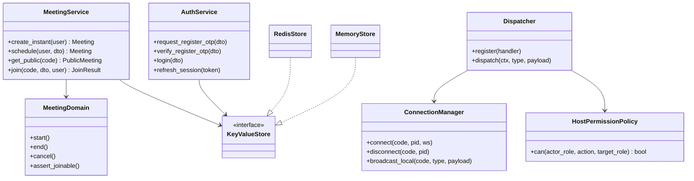

# Low-Level Design (LLD)

## 1. Layering Contract

| Layer | Knows about | Must NOT know about |
|---|---|---|
| Router / WS handler | Pydantic schemas, `Depends`, HTTP status | SQL queries, direct Redis calls, business rules |
| Service | Domain rules, repositories (interfaces), `KeyValueStore`, event bus | HTTP, FastAPI objects, Request/Response |
| Repository | SQLAlchemy models, SQL queries | Business rules, HTTP |
| Domain (`domain.py`) | Pure Python: state machines, invariants | Everything else (zero I/O, no DB/HTTP) |

## 2. Core Abstractions & Protocols

```python
class KeyValueStore(Protocol):
    async def get(self, key: str) -> str | None: ...
    async def set(self, key: str, value: str, *, ttl: int | None = None, nx: bool = False) -> bool: ...
    async def getdel(self, key: str) -> str | None: ...
    async def incr(self, key: str, *, ttl_on_create: int | None = None) -> int: ...
    async def delete(self, *keys: str) -> int: ...
    async def hset/hget/hdel/hgetall(...): ...

class PubSub(Protocol):
    async def publish(self, channel: str, message: str) -> None: ...
    async def subscribe(self, channel: str) -> AsyncIterator[str]: ...

class EmailSender(Protocol):
    async def send(self, to: str, subject: str, body: str) -> None: ...

class PermissionPolicy(Protocol):
    def can(self, actor_role: str, action: HostAction, target_role: str | None = None) -> bool: ...

class CommandHandler(Protocol):
    type: ClassVar[str]
    async def handle(self, ctx: RoomContext, payload: dict[str, Any]) -> None: ...
```

## 3. Class Diagram



## 4. Algorithms

### Meeting Code Generation
- 10-digit numeric codes generated with `secrets.randbelow(9_000_000_000) + 1_000_000_000`.
- Optimistic insert with unique collision retry loop (up to 5 attempts) to eliminate race conditions without table locking.

### Single-Use WebSocket Ticketing
1. Client makes REST `POST /meetings/{code}/join`.
2. Server mints cryptographic ticket (`secrets.token_urlsafe(32)`), storing participant identity in Redis with 30s TTL.
3. Client opens WebSocket `ws://api/ws/rooms/{code}?ticket=...`.
4. Server uses atomic `GETDEL ws:ticket:{ticket}` to claim and destroy ticket in one operation.
